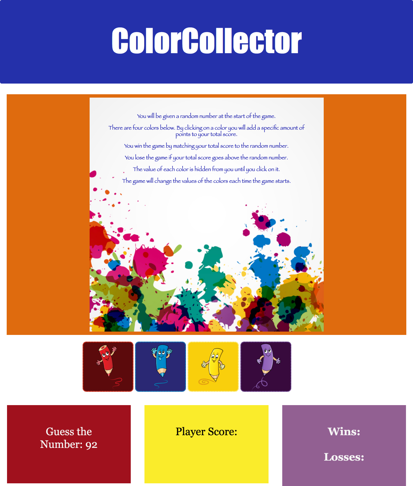

# unit-4-game

# Color Collector Game

## Option One: CrystalsCollector Game (Recommended)
### I chose a color theme

#### Instructions:
- The player will have to guess a random number between 19-120.
- Each crayon has a random hidden value between 1 - 12.

##### How the app works:
- There are four colors crayon displayed as buttons.
- The player will be shown a random number at the start of the game.
- When the player clicks on a crayon, it will add a specific amount of points to the player's total score.
- The players game will hide this amount until the player clicks a crayon.
- When the player clicks one, the player's score counter updates.

##### How the player wins or loses:
- The player wins if their total score matches the random number from the beginning of the game.
- The player loses if their score goes above the random number.
- The game restarts whenever the player wins or loses.

- When the game begins again, the player should see a new random number. Also, all the crayons have four new hidden values. 
- The player's score (and score counter) will reset to zero.
